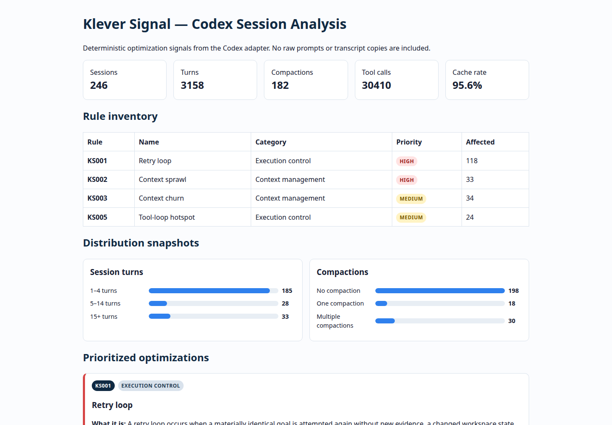
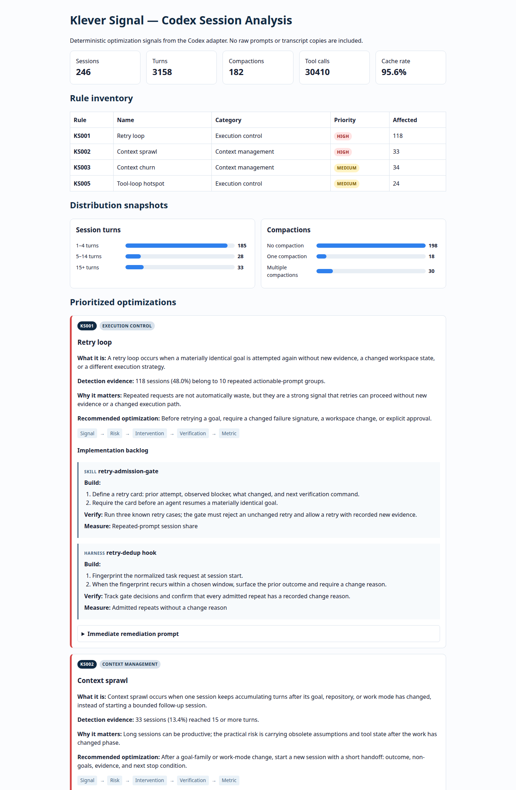

# Klever Signal

A local, privacy-preserving CLI for finding efficiency and prompt-engineering patterns in coding-agent sessions.

[](https://github.com/klever-engineering/klever-signal/actions/workflows/ci.yml)
[](LICENSE)

Current release: **v0.1.0** — the first public, local-only foundation. See the [changelog](CHANGELOG.md) and [release notes](docs/releasing.md).

The first adapter reads Codex JSONL homes passed explicitly with `--codex-home`. Klever Signal does not require a fixed machine path, copy transcripts, upload data, or retain raw prompt text. Reports contain only derived metrics, source-relative paths, and one-way prompt fingerprints.

## Why a CLI first?

The durable product is a CLI: it can run in cron or CI and produce machine-readable reports. A future agent skill can be a thin interpretation layer that invokes this command and explains the highest-value findings.

## Install

The package is not published to npm yet. Run the CLI directly from the public GitHub repository:

```bash
npx --yes github:klever-engineering/klever-signal --help
```

Or clone it for local development:

```bash
git clone https://github.com/klever-engineering/klever-signal.git
cd klever-signal
npm test
node bin/klever-signal.js --help
```

Once `@klever-engineering/klever-signal` is published to npm, the shorter
`npx @klever-engineering/klever-signal` form will become available.

For development, Node.js 20+ is the only requirement:

```bash
npm test
```

## Usage

```bash
npx --yes github:klever-engineering/klever-signal --codex-home ./my-codex-home
npx --yes github:klever-engineering/klever-signal --codex-home ./my-codex-home --format html --output report.html
npx --yes github:klever-engineering/klever-signal --codex-home ./my-codex-home --format json --output report.json
npx --yes github:klever-engineering/klever-signal resume --codex-home ./my-codex-home --rule KS001
```

For a complete local audit with shareable outputs:

```bash
npx --yes github:klever-engineering/klever-signal \
  --codex-home ./my-codex-home \
  --format html \
  --output reports/codex-session-audit.html
```

The reports directory is a suitable local or CI artifact location. The source session home is read in place; the audit does not copy transcripts into the report.

## Example audit

These screenshots show a real local audit generated from 246 Codex sessions. The figures are a point-in-time illustration of the report shape, not universal targets or claims about every coding environment.



_Overview: aggregate session signals, rule inventory, priorities, and distribution snapshots._



_Rule details: each signal connects detection evidence to risk, intervention, verification, and a metric._

## Initial Codex adapter

- sessions, turns, compactions, user messages, and tool calls;
- final reported token totals and cache ratio inputs;
- repeated actionable-prompt fingerprints across sessions;
- source-relative session locations for review.

Markdown and HTML reports use stable, Sonar-style rules (`KS001`, `KS002`, and so on) rather than anonymous threshold warnings. Each rule has a category, priority, detection evidence, why it matters, a remediation backlog, a verification procedure, and an outcome metric. The HTML report also visualizes session-turn and compaction distributions plus the path from signal to measurable improvement. Rules flag patterns such as retry-prone repeated prompts, oversized control sessions, dense compaction, weak cache reuse, and tool-loop hotspots. Thresholds are prompts for review, never claims of causality.

Every rule includes an immediate remediation prompt. It is an implementation-ready brief for creating the relevant skill, technique, or harness improvement, including verification and metric requirements. `resume` prints that prompt together with a representative source-relative session example and derived metrics. It deliberately does not print raw prompts or transcript content.

The first release deliberately separates deterministic collection from interpretation. It does not claim that a compaction or a long session was harmful without reviewing the relevant evidence. Claude and other coding-agent adapters are future capabilities, not current claims.

## Documentation

- [Architecture and extension points](docs/architecture.md)
- [Rule reference and rule contract](docs/rules.md)
- [Contributing](CONTRIBUTING.md)
- [Security policy](SECURITY.md)
- [Code of Conduct](CODE_OF_CONDUCT.md)
- [Releasing](docs/releasing.md)

## Rules

The rules are stable, named review signals rather than anonymous warnings. A signal identifies a pattern worth inspecting; it does not prove that the pattern caused a bad outcome.

| Rule | Pattern | Default signal | Practical response |
| --- | --- | --- | --- |
| `KS001` | Retry loop | A materially identical actionable prompt appears across sessions | Record what changed before retrying: new evidence, changed workspace state, or a different strategy |
| `KS002` | Context sprawl | A session reaches 15 or more turns | Split at a goal, repository, or work-mode boundary and carry a structured handoff |
| `KS003` | Context churn | At least two compactions, or compactions in 15% or more of turns | Preserve outcome, decisions, non-goals, verification state, and blockers in the resume contract |
| `KS004` | Cache instability | Cached input is below 30% of reported input tokens | Keep durable instructions and tool contracts in a stable prefix; append changing evidence afterward |
| `KS005` | Tool-loop hotspot | A session reaches three times the average tool-call volume, with a floor of 50 calls | State the next evidence needed, then stop, change hypothesis, or verify after a bounded tool batch |

The thresholds are deliberately conservative prompts for human review. They should be calibrated against the shape of a team’s work and treated as comparison points, not performance scores. A clean report means “these checks did not fire,” not “the session was optimal.”

## Why this project is needed

Coding-agent sessions produce a large amount of operational knowledge: which instructions remain useful, where the agent starts looping, when context stops matching the task, and which verification steps actually close the work. Without a systematic review, that knowledge disappears into individual transcripts and gets rediscovered repeatedly.

Klever Signal provides a small feedback loop:

```text
session evidence → deterministic signal → human interpretation → targeted change → measured follow-up
```

That loop matters because prompt and agent behavior are not fixed assets. As repositories, tools, policies, models, and team habits change, the instructions that worked last month can become noisy, contradictory, expensive, or incomplete. The project makes those changes inspectable without turning every session into a manual research exercise.

The approach follows a few durable principles:

- **Make important work legible.** A goal should have a visible outcome, scope, and verification boundary.
- **Prefer evidence over intuition.** A metric or repeated pattern selects what to review; it does not replace judgment.
- **Change one operating condition at a time when possible.** A prompt, skill, tool contract, or harness intervention should have a named before-and-after measure.
- **Keep feedback close to the work.** Findings should become a focused remediation prompt, a small technique, or a bounded harness change—not a vague list of aspirations.
- **Preserve human control.** The tool recommends review and improvement; it does not silently rewrite prompts, change policy, or claim causality.
- **Protect the material being studied.** Raw prompts and transcripts are private working material. Derived metrics are enough for most optimization decisions.

Prompts are a core control surface in any coding-agent system. They define the goal, constraints, available evidence, completion criteria, and expected output. They therefore need the same maintenance discipline as code: stable structure for durable rules, explicit separation between policy and volatile task data, tests or review criteria for important behavior, and measurement after changes. Klever Signal helps identify where that maintenance is most likely to pay off.

## From finding to improvement

Use a finding as a starting point for a small experiment:

1. Run an audit and select one high-value rule or representative session.
2. Read the detection evidence and inspect the source session qualitatively; the threshold is not a diagnosis.
3. Use `resume --rule KS00X` to obtain the privacy-preserving remediation brief.
4. Implement one intervention at the appropriate layer: prompt technique, skill, harness, or workflow.
5. Verify the stated behavior with a fixture, test, or repeatable review.
6. Compare the named metric before and after adoption, and keep the result—even if it shows that the intervention did not help.

This keeps optimization cumulative: each change leaves behind a clearer rule, a better prompt contract, or stronger evidence for the next session.

## Privacy model

- Source transcripts remain in place and are read only.
- Prompt text is not included in reports.
- No network requests are made.
- Authentication files are not read.

## Release checklist

1. Run the test command and a real audit against a disposable fixture home.
2. Review `CHANGELOG.md`, package metadata, the package contents, and the MIT license.
3. Follow [docs/releasing.md](docs/releasing.md) for tag, GitHub release, and npm publication steps.
